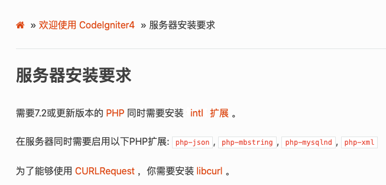
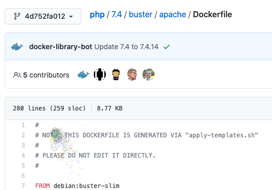
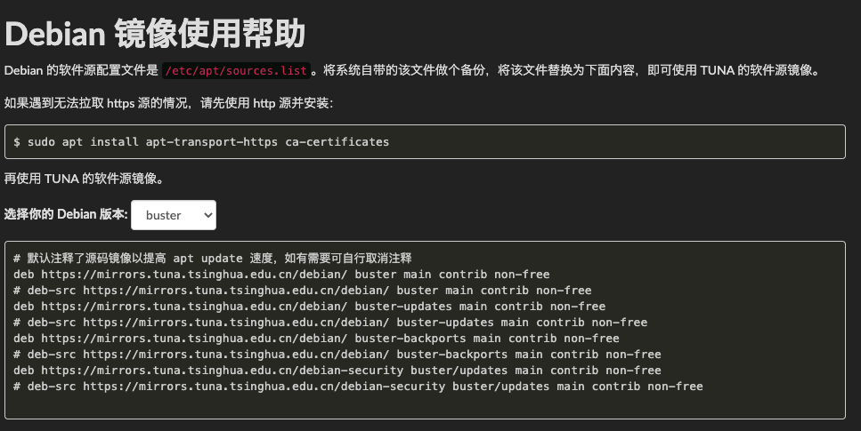
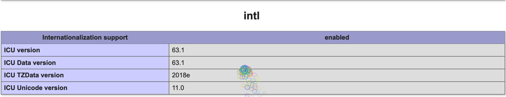
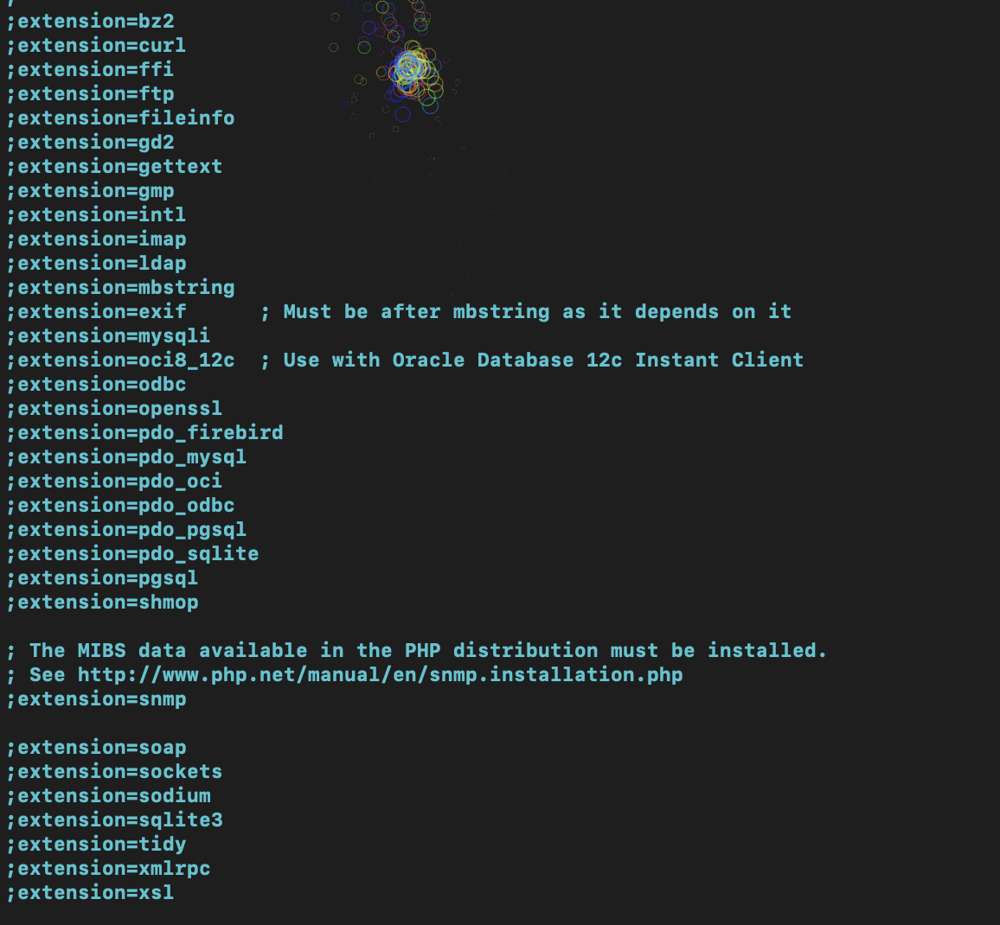
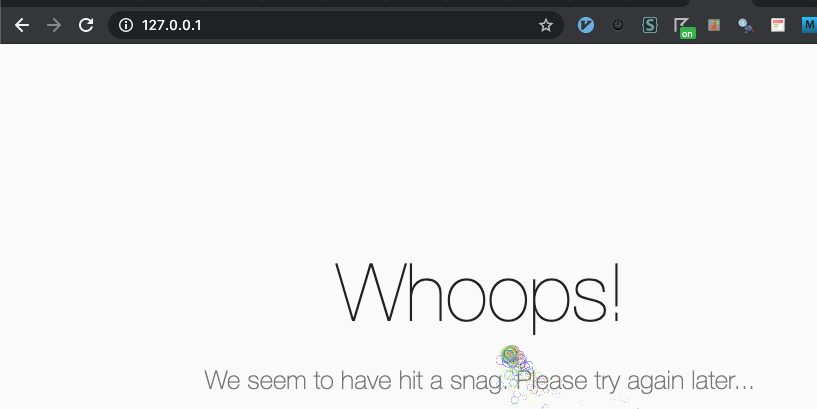
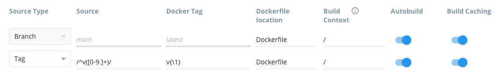
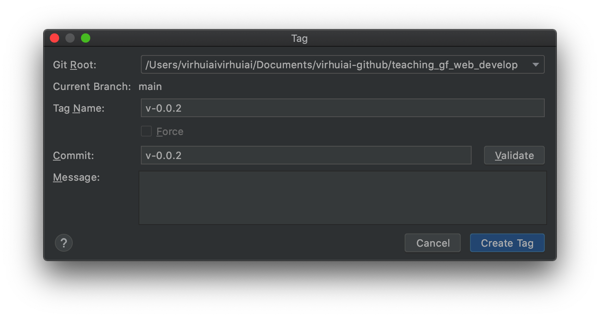

# 第1节，Docker搭建Codeigniter的开发环境

# 官方说明-服务器安装要求

首先我们到Codeigniter官方网站（中文站）看一下说明


```
https://codeigniter.org.cn/user_guide/intro/requirements.html
```





如果你也打开这个地址，你会发现，Intl左右有两个`*`，其实这汉化过来的时候没有做好。


需要7.2或更新版本的 PHP ：我们PHP就选择`php:7.4.8-apache`的Docker镜像好了


# 1. 选择Docker镜像


我们的Dockerfiel文件里面添加第1部分:


```
# https://hub.docker.com/_/php 在这个地方可以看到官方的php镜像，选择自己需要的。
FROM php:7.4.8-apache
```


这个版本的镜像是基于`debian:buster-slim`, 我们安装软件的时候就可以按debian操作系统的方式来：





# 2.软件源-配置国内镜像


我们如果在镜像`php:7.4.8-apache`这个基础上直接安装相应的软件，那么由于国内的网络问题你会发现，速度真的不是一般的慢。好在国内也有不少这方面的镜像可以使用。


Debian 的软件源配置文件是 `/etc/apt/sources.list`。


如果我们run这个镜像，我们可以看到`sources.list`它的内容是这样：


```
# cat sources.list.back.2021.01.19
# deb http://snapshot.debian.org/archive/debian/20200720T000000Z buster main
deb http://deb.debian.org/debian buster main
# deb http://snapshot.debian.org/archive/debian-security/20200720T000000Z buster/updates main
deb http://security.debian.org/debian-security buster/updates main
# deb http://snapshot.debian.org/archive/debian/20200720T000000Z buster-updates main
deb http://deb.debian.org/debian buster-updates main
```


可以看到`buster`字眼，将系统自带的该文件做个备份（先把旧的文件备份好这是一个很好的习惯）:


```
mv /etc/apt/sources.list /etc/apt/sources.list.back.2021.01.19
```


软件源配置文件，要配置镜像的设置可以从下面这个网站找到：


```
https://mirrors.tuna.tsinghua.edu.cn/help/debian/
```





我们的Dockerfiel文件里面添加第2部分:


```
#第2部分 apt update 加速
RUN echo '# 默认注释了源码镜像以提高 apt update 速度，如有需要可自行取消注释' > /etc/apt/sources.list && \
echo 'deb https://mirrors.tuna.tsinghua.edu.cn/debian/ buster main contrib non-free' >> /etc/apt/sources.list && \
echo '# deb-src https://mirrors.tuna.tsinghua.edu.cn/debian/ buster main contrib non-free' >> /etc/apt/sources.list && \
echo 'deb https://mirrors.tuna.tsinghua.edu.cn/debian/ buster-updates main contrib non-free' >> /etc/apt/sources.list && \
echo '# deb-src https://mirrors.tuna.tsinghua.edu.cn/debian/ buster-updates main contrib non-free' >> /etc/apt/sources.list && \
echo 'deb https://mirrors.tuna.tsinghua.edu.cn/debian/ buster-backports main contrib non-free' >> /etc/apt/sources.list && \
echo '# deb-src https://mirrors.tuna.tsinghua.edu.cn/debian/ buster-backports main contrib non-free' >> /etc/apt/sources.list && \
echo 'deb https://mirrors.tuna.tsinghua.edu.cn/debian-security buster/updates main contrib non-free' >> /etc/apt/sources.list && \
echo '# deb-src https://mirrors.tuna.tsinghua.edu.cn/debian-security buster/updates main contrib non-free' >> /etc/apt/sources.list && \
```


这里的第1行的是只有一个`>`为创建，其他行是`>>` 为追加, 最后一行的话尾部是`&& \`，因为后面还有没写完的, 一个RUN语句尽可能多的写一些，这也是Docker的最佳策略之一。


# 3.安装常用软件


可以多看看别人写的Dockerfile，借鉴一下别人的思路和各种写法。我们在php官方的Dockerfile（[php](https://github.com/docker-library/php/tree/4d752fa012280005e7d18f01092120ab9e2eb35c)/[7.4](https://github.com/docker-library/php/tree/4d752fa012280005e7d18f01092120ab9e2eb35c/7.4)/[buster](https://github.com/docker-library/php/tree/4d752fa012280005e7d18f01092120ab9e2eb35c/7.4/buster)/[apache](https://github.com/docker-library/php/tree/4d752fa012280005e7d18f01092120ab9e2eb35c/7.4/buster/apache)/**Dockerfile**）可以看到这样一部分：


```
RUN set -eux; \
	apt-get update; \
	apt-get install -y --no-install-recommends \
		$PHPIZE_DEPS \
		ca-certificates \
		curl \
		xz-utils \
	; \
	rm -rf /var/lib/apt/lists/*
```


这里，`set -eux;` 有三个意思：


1. e 若指令传回值不等于0，则立即退出shell。　　
2. u 当执行时使用到未定义过的变量，则显示错误信息。
3. x 执行指令后，会先显示该指令及所下的参数。

```
以上这三点参考自：
https://www.cnblogs.com/robinunix/p/11635560.html
```


其中`&` 、`;` 、`&&` 的区别的例子：


```
command1 & command2 & command3     三个命令同时执行 
command1; command2; command3          不管前面命令执行成功没有，后面的命令继续执行 
command1 && command2                         只有前面命令执行成功，后面命令才继续执行
```


我们的Dockerfiel文件里面添加第3部分:


```
#第3部分，安装 vim mlocate unzip wget
set -eux; \
	apt-get update && \
	apt-get install -y --no-install-recommends \
        vim \
        mlocate \
        unzip \
        tree \        
        wget && \
	rm -rf /var/lib/apt/lists/* && \
  apt-get clean
```


# 4. 安装`intl`:


我们的Dockerfiel文件里面添加第4部分,安装`intl`:


```
#第4部分 安装intl:
RUN apt-get update && \
apt-get install -y --no-install-recommends libicu-dev && \
rm -r /var/lib/apt/lists/* && \
docker-php-ext-install -j$(nproc) intl && \
docker-php-ext-install mysqli
```


在phpinf()里可以看到：




# 5.安装libcurl


我们的Dockerfiel文件里面添加第5部分,安装`libcurl`：


```
第5部分,安装libcurl：
RUN apt-get update && \
apt-get install -y --no-install-recommends libcurl4-openssl-dev && \
rm -r /var/lib/apt/lists/*
```


# 6. 选择Codeigniter版本

我们就选择4.04版本好了。它的下载地址在:


```
https://github.com/codeigniter4/framework/archive/v4.0.4.zip
```


将这个文件下载到我们的镜像里（Dockerfiel文件里）:


我们的Dockerfiel文件里面添加第6部分:


```
# 第6部分:
RUN mkdir /virhuiai/ && cd /virhuiai && wget https://github.com/codeigniter4/framework/archive/v4.0.4.zip && unzip v4.0.4.zip
```


解压后在目录`/virhuiai/framework-4.0.4`下


# 7. 配置php


查找 `php.ini` 的位置 

法一：locate命令


```
# updatedb
# locate php.ini
/usr/local/etc/php/php.ini-development
/usr/local/etc/php/php.ini-production
```


法二：在php的Dockerfile中能看到php.ini的位置


```
https://hub.docker.com/layers/php/library/php/7.4-apache/images/sha256-a04de56c0cd08d5372c07cedf8fdf0b609b61e947750c72589ff95fb10099948?context=explore
ENV PHP_INI_DIR=/usr/local/etc/php
```


复制生成开发环境的php.ini， 我们的Dockerfiel文件里面添加第7部分:


```
# 第7部分
RUN cp /usr/local/etc/php/php.ini-development /usr/local/etc/php/php.ini && \
```


先看下旧数据：


```
vim /usr/local/etc/php/php.ini
```





启用拓展，我们的Dockerfiel文件里面添加第8部分：


```
# 第7.2部分
sed -ri -e 's!;extension=intl!extension=intl!g' /usr/local/etc/php/php.ini && \
sed -ri -e 's!;extension=mysqli!extension=mysqli!g' /usr/local/etc/php/php.ini && \
sed -ri -e 's!;extension=mbstring!extension=mbstring!g' /usr/local/etc/php/php.ini && \
sed -ri -e 's!;extension=mbstring!extension=mbstring!g' /usr/local/etc/php/php.ini && \
sed -ri -e 's!;extension=pdo_sqlite!extension=pdo_sqlite!g' /usr/local/etc/php/php.ini \
```


# 8.设置apache目录


我们的Dockerfiel文件里面添加第8部分：


```
# 第8部分
#ENV APACHE_DOCUMENT_ROOT '/virhuiai/framework-4.0.4/public'
RUN sed -ri -e 's!/var/www/html!/virhuiai/framework-4.0.4/public!g' /etc/apache2/sites-available/*.conf && \
sed -ri -e 's!/var/www/!/virhuiai/framework-4.0.4/public!g' /etc/apache2/apache2.conf /etc/apache2/conf-available/*.conf
WORKDIR /virhuiai/framework-4.0.4/public
```


```
# 第9部分
# 镜像信息
LABEL Author="virhuiai"
LABEL Version="0.0.2"
LABEL Description="PHP APACHE CODEIGNITER 镜像"
```


# 9.镜像测试

```
cd /Users/virhuiaivirhuiai/Documents/virhuiai-github/teaching_gf_web_develop
docker build . -t tmpimg
docker run -d -p 80:80 --rm --name tmpimg_c tmpimg
```


启动，在宿主机上就可以使用了，这会目前因为未配置数据库，会报错





进入终端


```
docker exec -it tmpimg_c /bin/sh
```


#  10 拷贝文件到宿主机


```
docker cp tmpimg_c:/virhuiai/framework-4.0.4/ /Users/virhuiaivirhuiai/Documents/virhuiai-github/teaching_gf_web_develop
```


后面运行时就可以从外面映射到里面了。


发现Docker Hub上的配置需要修改下：





提交到Docker Hub,生成：





```
virhuiai/teaching_gf_web_develop:v-0.0.2
```


# 11 连接数据库


暂时用 `--link `的方式做示例：


```
docker run -e MYSQL_DATABASE=ci4_database_name -e MYSQL_ROOT_PASSWORD=Passw0rd! -p 3306:3306 --name ci4mysql57 -d mysql:5.7
```


```
docker container run --publish 80:80 -v /Users/virhuiaivirhuiai/Documents/ci-framework-4.0.3:/ci4/ --name ci4 --link ci4mysql57:mysql_db -d virhuiai/teaching_gf_web_develop:v-0.0.2
```


# 12  数据库配置

app/Config/Database.php


```
	public $default = [
		'DSN'      => '',
		'hostname' => 'mysql_db',
		'username' => 'root',
		'password' => 'Passw0rd!',
		'database' => 'ci4_database_name',
		'DBDriver' => 'MySQLi',
		'DBPrefix' => '',
		'pConnect' => false,
		'DBDebug'  => (ENVIRONMENT !== 'production'),
		'cacheOn'  => false,
		'cacheDir' => '',
		'charset'  => 'utf8',
		'DBCollat' => 'utf8_general_ci',
		'swapPre'  => '',
		'encrypt'  => false,
		'compress' => false,
		'strictOn' => false,
		'failover' => [],
		'port'     => 3306,
	];
```

