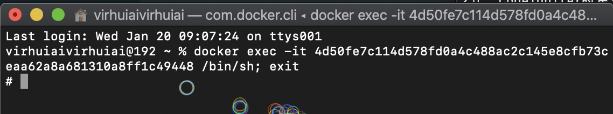

# 第2节，Codeigniter的第一条查询数据，通过docker-compose


Compose是Docker官方编排工具，我们可以用它来达成上一篇文章里面讲到的容器的依赖顺序。当前一个容器启动完毕之后再启动下一个容器。


本文参考了它的官方文档说明：


```
https://docs.docker.com/compose/
```


## 使用的镜像：


php镜像：


```
docker pull virhuiai/teaching_gf_web_develop:version-0.0.3
```

参见《第1节，Docker搭建Codeigniter的开发环境》  https://www.toutiao.com/i6919534118367691277/


mysql镜像：


```
mysql:5.7
```


## compose文件:


docker-compose.yml：


```yaml
version: "3"
services:
  web_ci:
    image: virhuiai/teaching_gf_web_develop:version-0.0.3
    ports:
      - "80:80"
    volumes:
      - /Users/virhuiaivirhuiai/Documents/virhuiai-github/teaching_gf_web_develop/framework-4.0.4:/virhuiai/framework-4.0.4/
    depends_on:
      - "mysql_db"
  mysql_db:
    image: mysql:5.7
    environment:
      - MYSQL_ROOT_PASSWORD=Passw0rd!
      - MYSQL_DATABASE=ci4_database_name
```


要注意的一点是，在`yaml`格式里面空格，别少了多了。


这边配置两个容器，第1个容器：


```
web_ci:
	image:virhuiai/teaching_gf_web_develop:version-0.0.3
```


这里指定了我们上一节生成的镜像。也可以使用当前目录下的Dockerfile编译出来而成，那么把这两行改成这样:


```
web_ci:
    build: .
```


接着是端口映射：


```
ports:
      - "80:80"
```


这个就和命令行中的`--publish 80:80` 或者它的简写形式`-p 80:80` 等同。


再接下来是宿主机和容器的目录映射：


```
volumes:
  - /Users/virhuiaivirhuiai/Documents/virhuiai-github/teaching_gf_web_develop/framework-4.0.4:/virhuiai/framework-4.0.4/  
```


这也对应着命令行中的`-v`命令参数。


然后就是很喜欢的依赖配置：


```
depends_on:
  - "mysql_db"
```


这会在下一个容器`mysql_db`启动完成之后再启动`web_ci`，这和书写的顺序无关。


然后是环境变量：


```
environment:
 - MYSQL_ROOT_PASSWORD=Passw0rd!
 - MYSQL_DATABASE=ci4_database_name
```


对应着命令行中的`-e`参数。


## 运行：


配置做好后启动它。


```
docker-compose up
```


哦，忘记了Docker没运行起来，运行后再跑一遍。


启动起来之后可以到Docker的面板看下：


## 数据库配置：


之前数据库链接的配置已经在上篇写过了，这边再贴一份：


app/Config/Database.php：


```php
    public $default = [
        'DSN'      => '',
        'hostname' => 'mysql_db',
        'username' => 'root',
        'password' => 'Passw0rd!',
        'database' => 'ci4_database_name',
        'DBDriver' => 'MySQLi',
        'DBPrefix' => '',
        'pConnect' => false,
        'DBDebug'  => (ENVIRONMENT !== 'production'),
        'cacheOn'  => false,
        'cacheDir' => '',
        'charset'  => 'utf8',
        'DBCollat' => 'utf8_general_ci',
        'swapPre'  => '',
        'encrypt'  => false,
        'compress' => false,
        'strictOn' => false,
        'failover' => [],
        'port'     => 3306,
    ];
```


根据ci官网的教程中的一篇，我们先来建个表备用。


```
https://codeigniter.org.cn/user_guide/tutorial/news_section.html
```


从这边点击cli按钮，进入容器的命令行。





```
# mysql -uroot -Dci4_database_name -p
```


```
select database();
```


可以看到现在当前数据库已经是我们在Codeigniter中配置的数据库了，现在我们给它插入一张表：


```
CREATE TABLE news (
                      id int(11) NOT NULL AUTO_INCREMENT,
                      title varchar(128) NOT NULL,
                      slug varchar(128) NOT NULL,
                      body text NOT NULL,
                      PRIMARY KEY (id),
                      KEY slug (slug)
);

INSERT INTO news VALUES
(1,'Elvis sighted','elvis-sighted','Elvis was sighted at the Podunk internet cafe. It looked like he was writing a CodeIgniter app.'),
(2,'Say it isn\'t so!','say-it-isnt-so','Scientists conclude that some programmers have a sense of humor.'),
(3,'Caffeination, Yes!','caffeination-yes','World\'s largest coffee shop open onsite nested coffee shop for staff only.');
```


现在在在浏览器里面输入`127.0.0.1`就不再是上一节中的报错信息了。


## 第一个例子:


默认也是在`/framework-4.0.4/app/Controllers/Home.php`这个文件里面的`Home`Controller的这个`index()`方法。


我们也不做输出出一个简单的helloworld，改为直接测试一下数据库是否可以连接，对`\App\Controllers\Home`里的index方法修改：


```php
<?php namespace App\Controllers;

use Config\Database;

class Home extends BaseController
{
	public function index()
	{
// 		return view('welcome_message');
        $db = Database::connect();
        $tables = $db->listTables();

        foreach ($tables as $table)
        {
            echo $table;
        }
	}

	//--------------------------------------------------------------------

}
```


这时候我们再打开浏览器，可以看到此时已经输出了所有的表名：


好了，这一节已经连接上数据库了，下节待续。


关于这篇文章的所有资料也可以在git上拉下来，