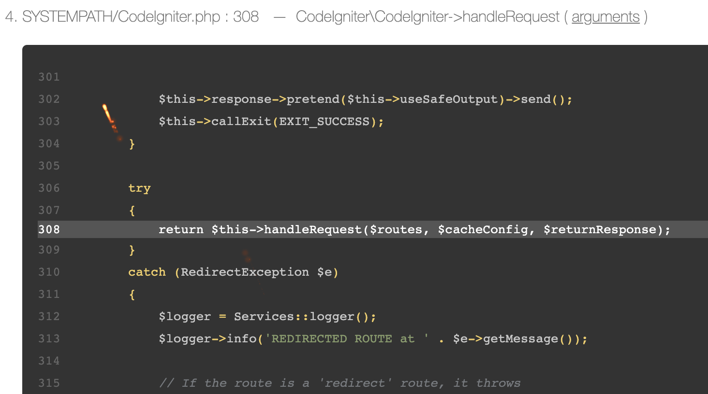

#### 法1、`.htaccess`文件配置法

apache设置为开发环境，public/.htaccess文件里加上

```
<IfModule mod_env.c>
Setenv CI_ENVIRONMENT development
</IfModule>
```

这样，出错时就有提示了

writable如不可操作时，可以运行（一般不需要）：

```
chmod -R 0777 /ci4/writable
```

#### 法2、使用`.env`文件来配置

```
% pwd
/Users/virhuiaivirhuiai/Documents/ci-framework-4.0.3
% mv env .env
```

在ci框架中，`system/bootstrap.php:157`处加载`.env`配置文件

```
require_once SYSTEMPATH . 'Config/DotEnv.php';
$env = new \CodeIgniter\Config\DotEnv(ROOTPATH);
$env->load();
```

可试一下修改`CI_ENVIRONMENT`

```
#-----------------
# ENVIRONMENT
#-----------------

# CI_ENVIRONMENT = production
```

将注释去除后，可以查看变化

```
var_dump($_ENV);
```

输出

```
array(1) { ["CI_ENVIRONMENT"]=> string(10) "production" }
```

这样，就可以根据配置的不同来区别开发和生产

> 之前的在apache的配置文件中也可以设置 

#### 测试报错显示

在文件 `app/Controllers/Home.php`的`index()`里直接输出一个未定义的变量，会报错：


下方还可以切换查看更多信息


点击arguments还可查看更多：





