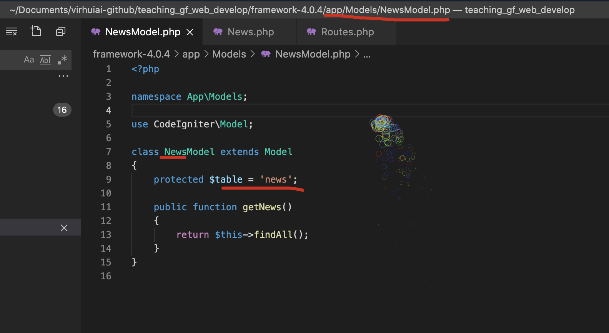
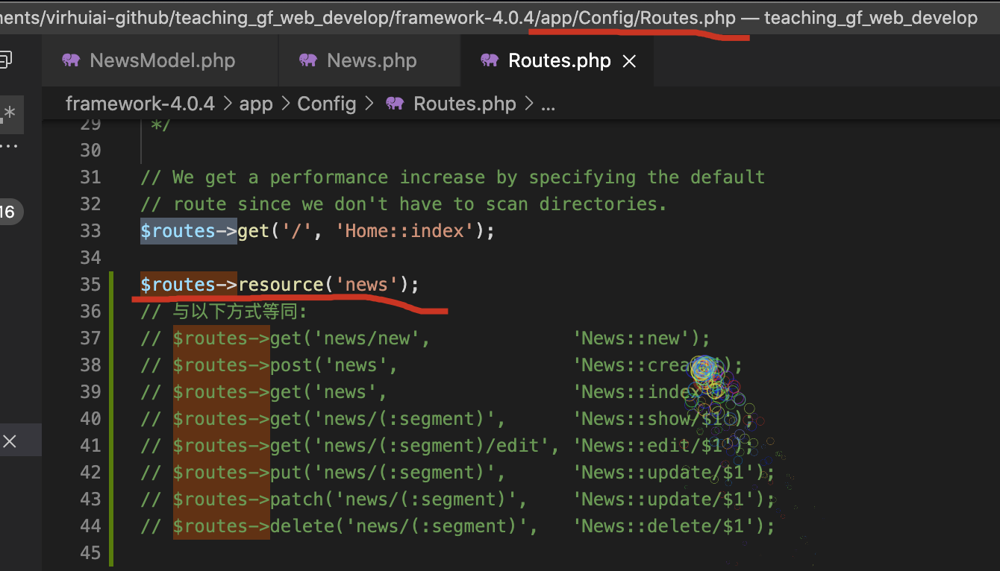
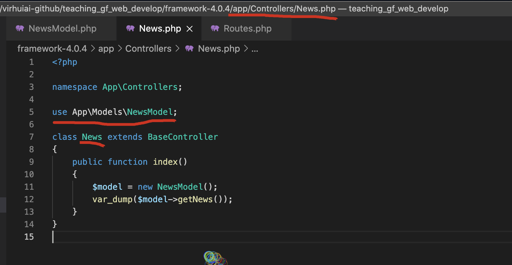
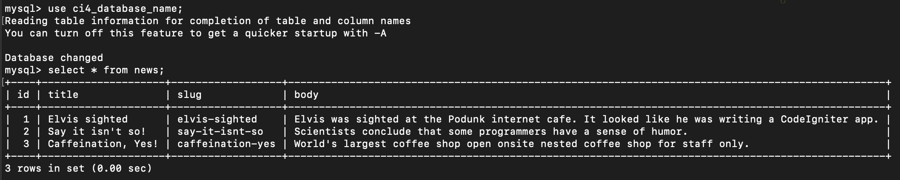
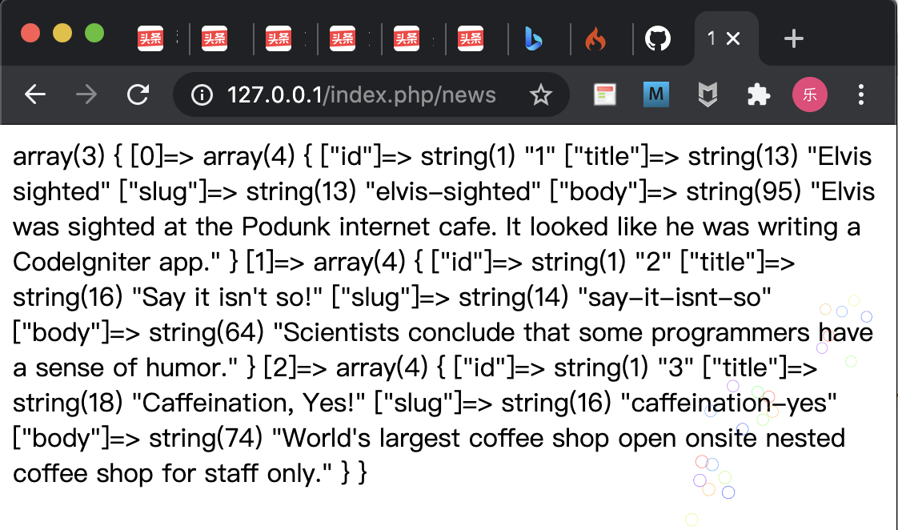

现在学习一下，CodeIgniter的增删改查的查。继续使用前面构建的镜像`virhuiai/teaching_gf_web_develop:version-0.0.4`。


# 准备model文件


`\App\Models\NewsModel`


```php
<?php

namespace App\Models;

use CodeIgniter\Model;
class NewsModel extends Model
{
    protected $table = 'news';

    public function getNews()
    {
        return $this->findAll();
    }
}
```





这里要注意一下model的文件的名字NewsModel，News后面是有Model的。另一个表名放在`$table`。


# 准备路由配置


路由配个


```php
$routes->resource('news');
// 与以下方式等同:
// $routes->get('news/new',             'News::new');
// $routes->post('news',                'News::create');
// $routes->get('news',                 'News::index');
// $routes->get('news/(:segment)',      'News::show/$1');
// $routes->get('news/(:segment)/edit', 'News::edit/$1');
// $routes->put('news/(:segment)',      'News::update/$1');
// $routes->patch('news/(:segment)',    'News::update/$1');
// $routes->delete('news/(:segment)',   'News::delete/$1');
```





# 准备Controller文件


```php
<?php

namespace App\Controllers;

use App\Models\NewsModel;

class News extends BaseController
{
	public function index()
	{
		$model = new NewsModel();
        var_dump($model->getNews());
	}
}
```





News的Controller里添加model并在index()里调用。


现在知道了吧，前面的model名字，为什么后面加个`Model`不直接用News，就是为了不和这边冲突。


现在数据的增删改查，我查字就做到了啊。


# 查

先在这个表里插入几条数据。





前面已经完成了对这个所有数据的查询代码了。我们输入网址`http://127.0.0.1/index.php/news`看一下效果。





现在我们只是做了一个查询直接返回。前端部分后面用单独的vue项目，就不和这个项目耦合了。


下节我们接着来讲剩下的三个。


